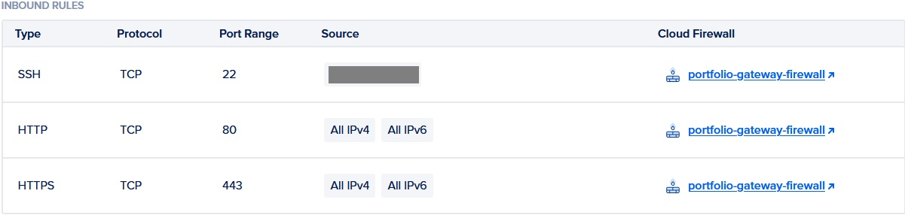
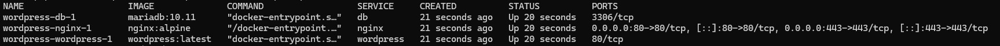
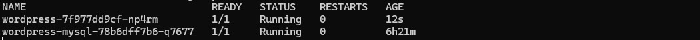

# Cloud Infrastructure & Platform Evolution: From Single-Node Containerization to Managed Kubernetes

This repository contains the Infrastructure as Code (IaC) used to automatically provision, configure, and secure a containerized application environment on DigitalOcean using Terraform, scaling from baseline Docker Compose setups up to a production-ready Kubernetes cluster.

As a network engineering professional transitioning to DevOps, this project serves as a practical implementation of secure infrastructure topology, modular configuration design, containerized application lifecycles, and cloud-native orchestration.

---

## ️ Architecture & Modular Topology
The infrastructure has been evolved from a monolithic single-node instance into a highly resilient, **Cloud-Native Cluster Architecture** separating global edge state from container runtime environments:

* **Infrastructure Provider:** DigitalOcean (Provisioned via Terraform)
* **Orchestration Engine:** DigitalOcean Kubernetes Service (DOKS) managing automated application pod lifecycles, self-healing container deployments, and internal cluster networking.
* **Traffic Routing & Load Balancing:** A managed DigitalOcean Load Balancer handles public edge interfaces, terminating outside requests and routing incoming HTTP traffic straight into the Kubernetes cluster.
* **Security & Network Hardening:** Cloud Firewalls strictly isolate backend node pools, ensuring public ingress points are restricted solely to expected web ports, while administrative access is tightly bound to zero-trust parameters.
* **Application Stability & Proxy Fixes:** Hardened WordPress environment definitions inside `wp-config.php` inject deterministic canonical domains (`http://eredawen.me`), bypassing routing loops and timeout issues commonly caused by upstream TLS/HTTP load-balancer offloading.

---

## Project Directory Structure
The codebase is organized into reusable components separating compute provisioning, network edge security, and declarative container state definitions:

```text
.
├── main.tf                     # Root infrastructure blueprint executing custom modules
├── variables.tf                # Global infrastructure input variables
├── docker-compose.yml          # Root multi-container configuration (Initial deployment phase)
├── README.md                   # System design, architecture, and roadmap documentation
│
├── k8s/                        # Managed Kubernetes cluster orchestration manifests
│   ├── cluster-issuer.tpl.yaml # Template for automated Let's Encrypt TLS certificate generation
│   ├── ingress.yaml            # Configures external traffic routing from cloud load balancer to services
│   ├── secrets.yaml            # Sealed environment variables and cluster keys
│   ├── wordpress-deployment.yaml # Declarative state management for application pods
│   ├── wordpress-pvc.yaml      # Persistent Volume Claim for stateful, non-volatile storage
│   └── wordpress-service.yaml  # Internal cluster service abstraction and routing
│
├── local_sandbox/              # Sandboxed local testing and historical workspace
│   ├── docker-compose.yml      # Local scratchpad environment deployment profile
│   ├── wp-config.php           # Local runtime application parameters
│   └── wordpress-service-backup.yaml # Redundant legacy service configuration snapshot
│
└── modules/                    # Reusable, decoupled infrastructure components
    ├── compute_server/         # Provisions baseline virtual private server (Droplet) layers
    │   ├── main.tf
    │   ├── outputs.tf
    │   ├── variables.tf
    │   └── config/             # Environment context and reverse proxy configurations
    │       ├── .env            # (Ignored via gitignore - Local instance configuration)
    │       ├── docker-compose.yml # Legacy single-node multi-container definition
    │       └── nginx/
    │           └── default.conf # Custom web server reverse proxy configuration blocks
    │
    ├── kubernetes_cluster/     # Provisions managed cloud-native cluster node topologies
    │   ├── main.tf
    │   ├── outputs.tf
    │   └── variables.tf
    │
    └── security/               # Enforces remote cloud perimeter network firewall matrices
        └── main.tf
```
---
##  Technical Progression Pathway

This workspace tracks an active, evolutionary learning path. It maps the transition from standalone cloud resource provisioning (Cloud Engineering) to automated, high-availability application lifecycles and runtime orchestration (DevOps).

* **Milestone 1: Application Containerization (Docker)** – Engineered and validated a localized, multi-container application runtime stack using Docker Compose for local environment predictability.
* **Milestone 2: Infrastructure as Code (Terraform)** – Transitioned from manual resource creation to automated cloud provisioning on DigitalOcean using flat, single-state Terraform architectures.
* **Milestone 3: Modularization & Perimeter Hardening** – Refactored monolithic IaC codebases into decoupled, reusable modules while implementing strict administrative zero-trust network boundaries.
* **Milestone 4: Cloud-Native Cluster Orchestration (Kubernetes) [Active Focus]** – Migrating and scaling the runtime environment out of legacy standalone hosts into a highly resilient, managed DOKS cluster topology behind a cloud load balancer.
---

### Milestone 1–3 Summary (Containerization & Modular Infrastructure)
* **Decoupled Footprint:** Separated the compute instance layer dynamically from global infrastructure definitions using modular inputs and outputs.
* **Zero-Trust Network Perimeter:** Restricted administrative Port 22 (SSH) access exclusively to authorized administrative IP ranges.
* **Local-to-Cloud Runtime Parity:** Integrated and validated multi-container execution contexts directly within modular Terraform state tracking pathways.

### Milestone 4 Summary (Managed Kubernetes Migration) [Active Focus]
* **Cloud-Native Infrastructure:** Migrating the core runtime environment out of legacy standalone hosts into a highly resilient, managed DOKS cluster topology.
* **Edge Traffic Management:** Provisioned a cloud-managed Load Balancer mapping incoming public edge traffic for `eredawen.me` directly to active cluster target nodes.
* **Network Loop Mitigation:** Resolved multi-tier proxy loopbacks by programmatically overriding internal application parameters (`WP_HOME` / `WP_SITEURL`) dynamically within active container volumes.
* **Container Introspection & Auditing:** Utilized remote container runtime execution (`kubectl exec`) to securely authenticate, drop into isolated database shells, and audit live production database schemas (`wordpress_db`).

---

## Operational Verification & Perimeter Security
To validate perimeter isolation, container runtime integrity, and successful cluster migration, the following operational state captures were recorded directly from the cloud environment:

### 1. Cloud Perimeter Firewall Matrix
The infrastructure enforces strict boundary segregation at the network edge. As verified in the security control configuration below, public access is tightly locked down:


* **Administrative Isolation:** Port 22 (SSH) ingress is blocked globally and restricted exclusively to authorized administrative ranges.
* **Public Web Ingress:** Perimeter interfaces allow only standard HTTP (80) and HTTPS (443) traffic through to the cluster endpoints.

---

### 2. Isolated Container Runtime Status (Milestone 1–3)
Prior to cluster migration, the standalone application environment was verified locally and within modular tracking pathways to guarantee clean runtime configurations:


* **Process Verification:** Confirmed stable container health states and mapped appropriate localized proxy loop parameters.

---

### 3. Kubernetes Live Pod Status (Milestone 4 Orchestration)
The live production architecture demonstrates successful scheduling, service mapping, and cluster-native runtime health:


* **Dynamic Orchestration:** Demonstrates responsive, self-healing pod topologies running actively within the managed DOKS environment.

---

### 4. Edge Ingress DNS & Traffic Resolution
To verify that public traffic cleanly bypasses legacy single-node paths and hits the managed cloud load balancer directly, a live network resolution query was executed:

```powershell
> nslookup eredawen.me
Non-authoritative answer:
Name:    eredawen.me
Address:  203.0.113.99